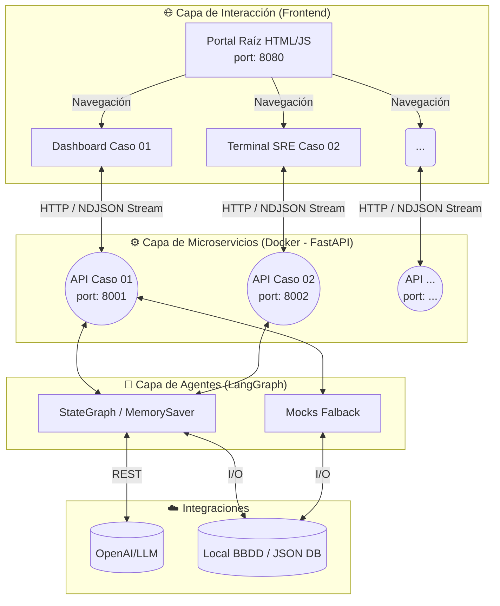
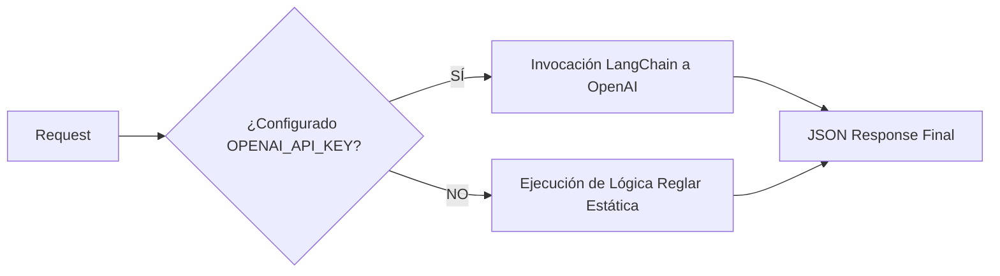

# 🏗️ Arquitectura del Sistema

> [!NOTE]
> **Versión**: 3.7.0 | **Estado**: Industrial | **Audiencia**: Arquitectos Cloud, System Designers, DevOps

## 👁️ Visión General

**LangGraph Realworld** utiliza un patrón de diseño Monorepo enfocado en la encapsulación de microservicios. A diferencia de los repositorios monolíticos con la lógica empotrada en rutas, cada caso de uso industrial implementado reside en su propio subdirectorio aislado con su propio backend FastAPI, servidor web Vanilla JS y Dockerfile.

## 🕸️ Topología de Componentes

```mermaid
graph TD
    subgraph UI ["🌐 Capa de Interacción (Frontend)"]
        A[Portal Raíz HTML/JS \n port: 8080]
        B1[Dashboard Caso 01]
        B2[Terminal SRE Caso 02]
        B3(...)
        
        A -->|Navegación| B1
        A -->|Navegación| B2
        A -->|Navegación| B3
    end

    subgraph BE ["⚙️ Capa de Microservicios (Docker - FastAPI)"]
        API1((API Caso 01 \n port: 8001))
        API2((API Caso 02 \n port: 8002))
        API3((API ... \n port: ...))
    end
    
    subgraph IA ["🧠 Capa de Agentes (LangGraph)"]
        LG1[StateGraph / MemorySaver]
        LG2[Mocks Falback]
    end

    subgraph EXT ["☁️ Integraciones"]
        OpenAI[(OpenAI/LLM)]
        DB[(Local BBDD / JSON DB)]
    end

    B1 <-->|HTTP / NDJSON Stream| API1
    B2 <-->|HTTP / NDJSON Stream| API2
    B3 <-->|HTTP / NDJSON Stream| API3

    API1 <--> LG1
    API2 <--> LG1
    API1 <--> LG2

    LG1 <-->|REST| OpenAI
    LG1 <-->|I/O| DB
    LG2 <-->|I/O| DB
```

## 🧠 Flujo Agentic (El Rol de LangGraph)

El sistema NO trata al LLM (Modelo de Lenguaje Grande) como un asistente conversacional genérico. Lo trata como un **Router Lógico**.
1. **Definición de Estado:** Se usa `TypedDict` para mantener la memoria y variables de la solicitud actual intactas y limpias a través de los nodos lógicos.
2. **Ciclos Controlados:** La información viaja entre funciones de Python clásicas (Tools, Consultas SQL, Consultas MongoDB) de las cuales los LLMs evalúan outputs condicionales y deciden qué camino seguir en la gráfica vectorial. 

## 🛡️ Diseño Resiliente "Dual-Mode"

Para garantizar que el portafolio pueda ser desplegado y evaluado por terceros (Stakeholders, Jefes de Proyecto) sin costo alguno ni configuraciones estresantes de API, la arquitectura emplea un patrón **Modo Dual**:

```mermaid
graph LR
    Req[Request] --> Check{¿Configurado OPENAI_API_KEY?}
    Check -->|SÍ| NodeLLM[Invocación LangChain a OpenAI]
    Check -->|NO| NodeMock[Ejecución de Lógica Reglar Estática]
    NodeLLM --> Out[JSON Response Final]
    NodeMock --> Out
```
El `index.html` central también actúa como *Configurator* para sobreescribir las settings, permitiendo escalar de una prueba MOCK a una prueba completa en Segundos.
