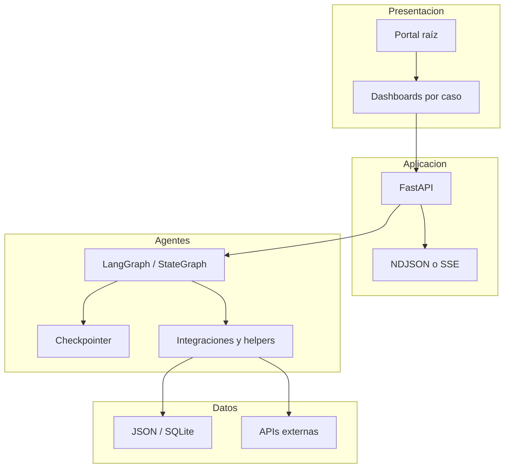

# 🏗️ Arquitectura del Sistema

> [!NOTE]
> **Versión**: 3.4.0 | **Estado**: Industrial | **Audiencia**: Arquitectos, DevOps, Seniors

Este documento describe la arquitectura vigente de **LangGraph Realworld** y explica qué partes del repositorio son referencia real y cuáles siguen siendo scaffolds o demos simples.

---

## Visión General

El proyecto está organizado como un monorepo de casos de uso. Cada carpeta en `cases/` representa un escenario independiente, pero solo una parte del catálogo tiene hoy backend productizable.

### Casos de referencia

- **Caso 09**: screening, shortlist, agenda y notificaciones con foco en resiliencia.
- **Caso 10**: onboarding empresarial con RBAC, checklist e integraciones híbridas.
- **Caso 13**: analítica conversacional con SQL seguro, base demo reproducible y visualización dinámica.

---

## Capas del Sistema

```mermaid
graph TD
  subgraph Presentacion
    Portal[Portal raíz]
    Dash[Dashboards por caso]
  end

  subgraph Aplicacion
    API[FastAPI]
    Stream[NDJSON o SSE]
  end

  subgraph Agentes
    Graph[LangGraph / StateGraph]
    Check[Checkpointer]
    Tools[Integraciones y helpers]
  end

  subgraph Datos
    Files[JSON / SQLite]
    External[APIs externas]
  end

  Portal --> Dash
  Dash --> API
  API --> Stream
  API --> Graph
  Graph --> Check
  Graph --> Tools
  Tools --> Files
  Tools --> External
```

---

## Estado y Persistencia

La implementación actual usa dos enfoques distintos:

- **Casos 09 y 10**: compilan con `MemorySaver` para priorizar portabilidad local, demos repetibles y tests sencillos.
- **Caso 13**: usa SQLite como base de datos del dominio BI, no como checkpointer de LangGraph.

La arquitectura mantiene el contrato abierto para evolucionar a checkpointers durables cuando el caso lo requiera.

---

## Observabilidad

El estándar actual exige:

- `/health` para liveness.
- `/ready` para readiness funcional.
- logs estructurados cuando el caso ya tiene capa de trazabilidad.
- streaming cuando la UX se beneficia de feedback incremental.

Hoy esto se cumple con más madurez en los casos 09, 10 y 13.

---

## Arquitectura Híbrida

Los casos industriales pueden operar en dos modos:

1. **Demo / offline**: datos de ejemplo y lógica deterministicamente reproducible.
2. **Live / real**: activación vía `.env` o variables de entorno para usar APIs o LLMs.

Este patrón permite demostrar UX y flujo sin depender siempre de credenciales externas.

---

## Estándares Industriales (v3.4.0)

A día de hoy, el estándar del repositorio significa:

1. **Backend real** con FastAPI y contrato operativo claro.
2. **Estado tipado** con `TypedDict` o esquema equivalente explícito.
3. **Documentación de ejecución** por Docker, Hub y modo local.
4. **Pruebas o validaciones mínimas** para la parte crítica del caso.
5. **Separación razonable** entre API, lógica del grafo, configuración y datos.

---

## La Tríada Industrial

### Caso 09

- Orquesta carga de datos, scoring, shortlist, agenda y notificación.
- Su fortaleza principal es la resiliencia del flujo y la observabilidad.

### Caso 10

- Modela onboarding empresarial con ramas por rol y degradación controlada por integración.
- Su fortaleza principal es la complejidad de negocio y el aprovisionamiento híbrido.

### Caso 13

- Traduce lenguaje natural a SQL, ejecuta consultas seguras y grafica resultados.
- Su fortaleza principal es la experiencia BI completa: datos, backend, validación y UI.

---

## Navegación

- [README.md](../README.md)
- [TECHNICAL_SPECS.md](TECHNICAL_SPECS.md)
- [INSTALL.md](INSTALL.md)
- [REQUIREMENTS.md](REQUIREMENTS.md)
- [SECURITY.md](../SECURITY.md)