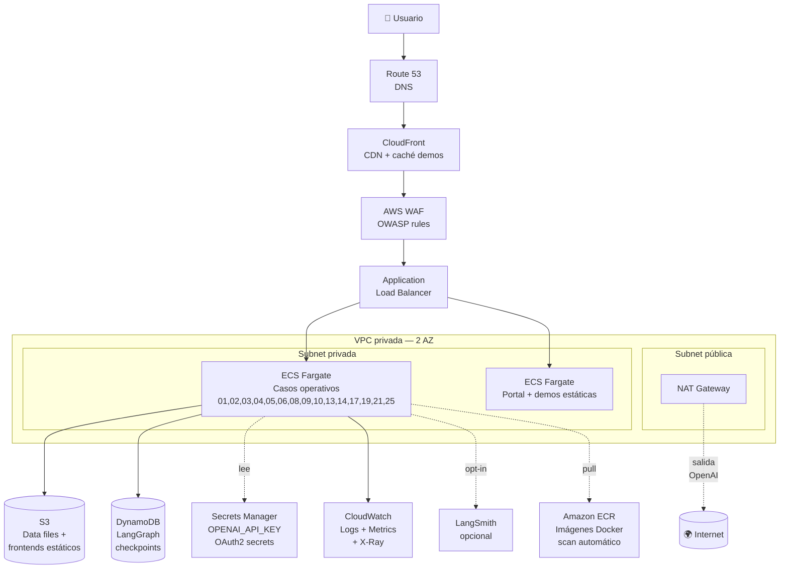
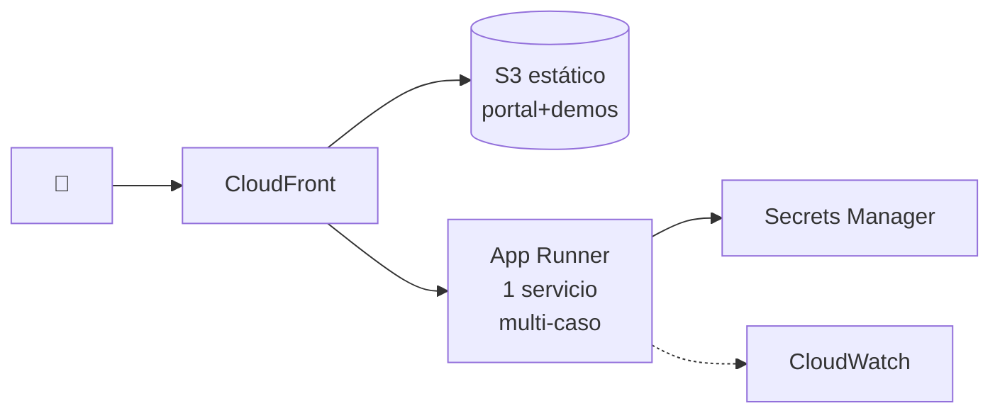
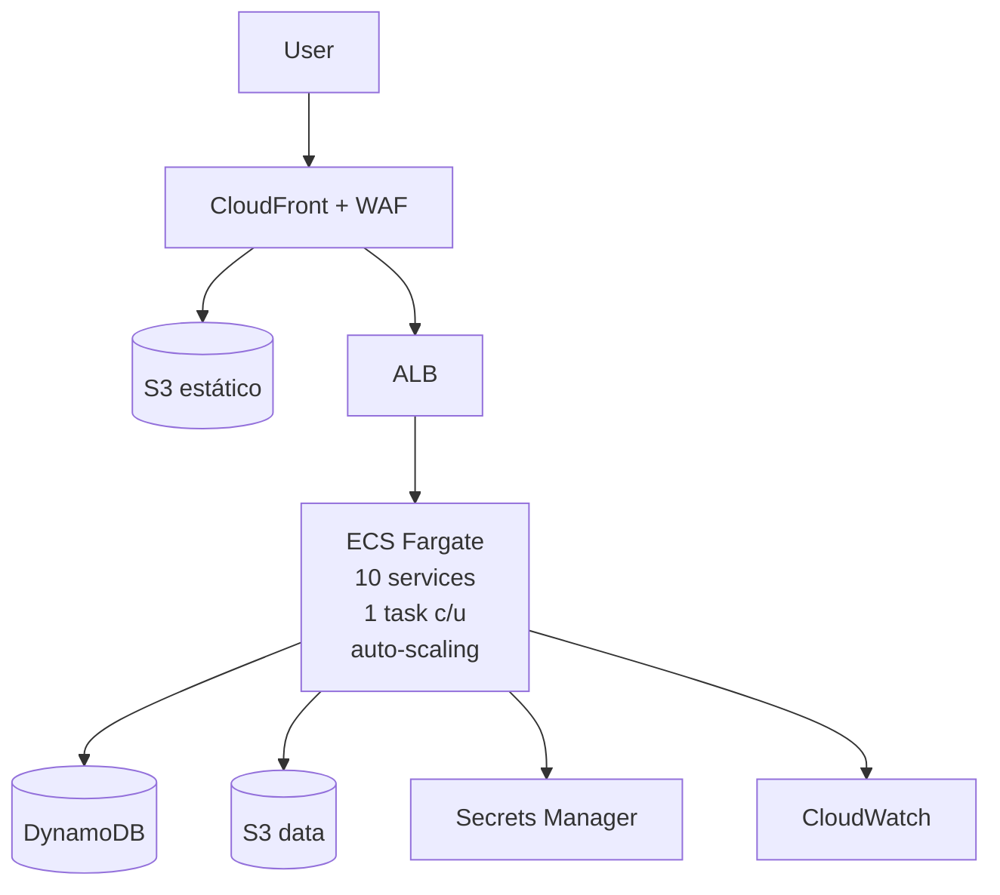
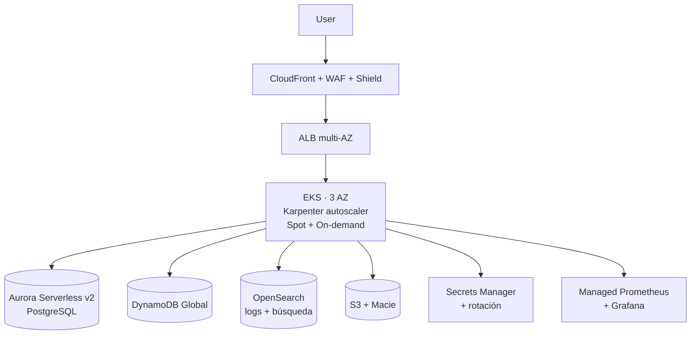
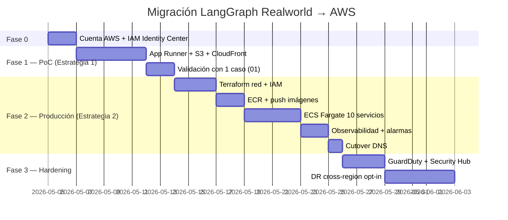

# ☁️ Migración a la Nube — AWS

> [!NOTE]
> **Versión**: 4.13.0 | **Estado**: Guía estratégica | **Audiencia**: Arquitectos Cloud, DevOps, CTO/Tech Leads, FinOps
> **Alcance**: portar el portfolio (21 backends FastAPI + 4 demos estáticas + portal) desde Docker local a AWS, con análisis técnico, paso a paso, costos y trade-offs.

---

## 🎯 Resumen ejecutivo

| Aspecto | Estado actual | Estado objetivo en AWS |
|:---|:---|:---|
| 🖥️ Cómputo | Docker Compose en laptop | Contenedores gestionados (ECS Fargate / App Runner / EKS) |
| 🌐 Exposición | `127.0.0.1:8001-8025` + nginx local | ALB + WAF + CloudFront + Route 53 + ACM |
| 🔑 Secretos | `.env` en disco | AWS Secrets Manager + SSM Parameter Store |
| 📊 Observabilidad | `/metrics`, logs JSON, LangSmith | CloudWatch Logs + Metrics + X-Ray + LangSmith |
| 🛡️ Seguridad 8 capas | Hardening local | + IAM, KMS, GuardDuty, Inspector, Security Hub |
| 💾 Datos | Volúmenes read-only | S3 (data files) + DynamoDB (state/checkpoints) |
| 🐳 Imágenes | Build local | Amazon ECR con scan automático |
| 🚀 CI/CD | GitHub Actions | GitHub Actions + OIDC → AWS (sin keys) |

> [!TIP]
> Hay **tres estrategias** documentadas más abajo: **PoC económico** (~25 USD/mes), **Producción equilibrada** (~180 USD/mes) y **Enterprise multi-AZ** (~650 USD/mes). Elige según tu fase.

---

## 🗺️ Arquitectura objetivo — vista general



> [!NOTE]
> El diagrama refleja la opción recomendada (Estrategia 2 — Producción). Las otras dos estrategias simplifican o expanden este mismo blueprint.

---

## 🧩 Mapeo de tecnologías — Docker local → AWS

| Componente actual | Servicio AWS recomendado | Alternativas | Por qué |
|:---|:---|:---|:---|
| `python:3.11-slim` + FastAPI por caso | **ECS Fargate** | App Runner · EKS · Lambda (con Mangum) | Sin servidores que parchar, escalado por servicio, soporta long-running streams (SSE) |
| Portal (`http.server` + static HTML) | **S3 + CloudFront** | Amplify Hosting | Costo casi nulo y caché global; los demos `9004-9024` también |
| `nginx:tls` (reverse proxy + TLS) | **ALB + ACM** | API Gateway HTTP · CloudFront | TLS gestionado, certificados gratis con ACM |
| `.env` con `OPENAI_API_KEY` | **Secrets Manager** | SSM Parameter Store (SecureString) | Rotación, IAM granular, auditoría CloudTrail |
| `data/` JSON read-only por caso | **S3** (bucket por entorno) | EFS si se requiere POSIX | Versionado, cifrado SSE-KMS, lifecycle |
| LangGraph `MemorySaver` (en proceso) | **DynamoDB** + checkpointer custom | Aurora Serverless v2 PG · ElastiCache Redis | Persistencia de checkpoints, single-digit ms, on-demand |
| `/metrics` Prometheus | **CloudWatch Embedded Metric Format (EMF)** | AMP (Managed Prometheus) + AMG (Grafana) | EMF reutiliza logs; AMP si ya hay PromQL |
| Logs JSON estructurados | **CloudWatch Logs** + Logs Insights | OpenSearch Service | Query nativo, retention configurable |
| LangSmith opt-in | LangSmith SaaS (sin cambio) | — | Funciona idéntico; el endpoint sale por NAT |
| GitHub Actions CI | GitHub Actions + **OIDC → IAM Role** | CodePipeline + CodeBuild | Sin access keys estáticas; AssumeRoleWithWebIdentity |
| `grype` + `detect-secrets` | + **ECR scan on push** + **Inspector v2** | Snyk · Trivy en CI | Doble capa imagen y runtime |
| Hardening 8 capas | + **WAF**, **GuardDuty**, **Security Hub**, **KMS** | — | Defensa en profundidad cloud-native |

---

## 📊 Tres estrategias de despliegue

### Estrategia 1 — 🧪 PoC / Demo pública (~25 USD/mes)



**Cuándo**: enseñar el portfolio a un cliente, demos en vivo, validar arquitectura.

| Componente | Configuración | Costo aprox/mes |
|:---|:---|---:|
| App Runner · 1 servicio · 0.25 vCPU / 0.5 GB | Auto-scale 1→3, pausa cuando no hay tráfico | ~7 USD |
| S3 + CloudFront (portal + 12 demos) | 5 GB egress, 100k requests | ~3 USD |
| Secrets Manager (1 secreto) | OpenAI key | 0.40 USD |
| CloudWatch Logs (5 GB) | Retention 7 días | ~2 USD |
| Route 53 hosted zone | dominio.com | 0.50 USD |
| ACM | TLS gratis | 0 USD |
| Data transfer + NAT | sin VPC privada (App Runner gestionado) | ~5 USD |
| **Total estimado** | | **~18-25 USD/mes** |

> [!TIP]
> App Runner monta Fargate detrás, expone HTTPS automáticamente, lee de ECR y se integra con Secrets Manager. Es el camino más corto desde el `Dockerfile` actual.

### Estrategia 2 — 🏭 Producción equilibrada (~180 USD/mes) ⭐ recomendado



**Cuándo**: el portfolio se usa internamente, hay tráfico predecible, se requiere SLA.

| Componente | Configuración | Costo aprox/mes |
|:---|:---|---:|
| ECS Fargate · 10 services · 0.5 vCPU / 1 GB · 24/7 | 1 task por caso operativo | ~110 USD |
| ALB + reglas host-based / path-based | 1 ALB compartido | ~22 USD |
| NAT Gateway (1 AZ) | salida a OpenAI | ~33 USD |
| CloudFront + S3 (portal + demos) | igual que estrategia 1 | ~3 USD |
| WAF (1 ACL, reglas managed) | OWASP top 10 | ~7 USD |
| DynamoDB on-demand (checkpoints) | <1M req/mes | ~2 USD |
| Secrets Manager (5 secretos) | rotación opcional | ~2 USD |
| CloudWatch (20 GB logs + metrics) | retention 30 días | ~10 USD |
| ECR (10 GB) | escaneo on-push | ~1 USD |
| Route 53 + ACM | | ~0.50 USD |
| **Total estimado** | | **~180-200 USD/mes** |

> [!IMPORTANT]
> El **NAT Gateway** es el coste sorpresa más común (~33 USD/mes solo por estar encendido). En PoC se evita con App Runner; en prod se acepta porque las tasks viven en subnet privada.

### Estrategia 3 — 🏛️ Enterprise multi-AZ + EKS (~650 USD/mes)



**Cuándo**: portfolio embebido en una plataforma corporativa, compliance (SOC2 / ISO27001 / HIPAA), tráfico variable alto.

| Componente | Configuración | Costo aprox/mes |
|:---|:---|---:|
| EKS control plane | 1 cluster | 73 USD |
| Worker nodes (Karpenter, Spot 70%) | ~6 vCPU promedio | ~150 USD |
| Aurora Serverless v2 (0.5-4 ACU) | replicación checkpoints | ~80 USD |
| OpenSearch t3.small.search × 3 | logs + traces | ~110 USD |
| NAT Gateways (2 AZ) | HA | ~66 USD |
| ALB + WAF + Shield Standard | DDoS L3/L4 | ~30 USD |
| AMP + AMG (Grafana) | observabilidad | ~50 USD |
| GuardDuty + Security Hub + Inspector | postura | ~40 USD |
| KMS (CMK por workload) | cifrado granular | ~5 USD |
| Backups + DR cross-region | RTO 1h | ~40 USD |
| **Total estimado** | | **~650-750 USD/mes** |

> [!WARNING]
> EKS solo se justifica si ya hay equipo Kubernetes dedicado. Para 10 microservicios stateless, **ECS Fargate sigue siendo más simple, barato y suficiente**.

---

## 🚀 Paso a paso — Estrategia 2 (recomendada)

### Fase 0 — Prerequisitos (Día 1)

```bash
# 1. Cuenta AWS con MFA en root + IAM Identity Center
# 2. AWS CLI v2 instalado y configurado
aws configure sso

# 3. Herramientas
brew install awscli terraform aws-cdk          # macOS
choco install awscli terraform aws-cdk         # Windows
```

| Artefacto | Acción |
|:---|:---|
| Dominio | Comprar/transferir a Route 53 |
| Certificado | Solicitar en ACM (`us-east-1` para CloudFront, región del ALB para ALB) |
| OIDC GitHub → AWS | Crear IAM provider `token.actions.githubusercontent.com` |
| IAM Role para CI | Trust policy con `sub: repo:vladimiracunadev-create/langgraph-realworld:ref:refs/heads/main` |

### Fase 1 — Empaquetado y registro (Día 2)

```bash
# Crear repos ECR (uno por caso operativo)
for case in 01 02 03 04 05 09 10 13 19 25; do
  aws ecr create-repository \
    --repository-name "lgr/case${case}" \
    --image-scanning-configuration scanOnPush=true \
    --encryption-configuration encryptionType=KMS
done

# Login + build + push (ejemplo caso 01)
aws ecr get-login-password --region us-east-1 \
  | docker login --username AWS --password-stdin <acct>.dkr.ecr.us-east-1.amazonaws.com

docker build -t lgr/case01 cases/01-soporte-cliente-omnicanal/backend
docker tag lgr/case01:latest <acct>.dkr.ecr.us-east-1.amazonaws.com/lgr/case01:v4.13.0
docker push <acct>.dkr.ecr.us-east-1.amazonaws.com/lgr/case01:v4.13.0
```

> [!TIP]
> Automatiza el bucle anterior en `.github/workflows/aws-deploy.yml` usando OIDC. Sin secretos estáticos en GitHub.

### Fase 2 — Red y seguridad (Día 3)

```hcl
# terraform/network.tf — extracto
module "vpc" {
  source  = "terraform-aws-modules/vpc/aws"
  name    = "lgr-prod"
  cidr    = "10.20.0.0/16"
  azs     = ["us-east-1a", "us-east-1b"]
  public_subnets  = ["10.20.0.0/24", "10.20.1.0/24"]
  private_subnets = ["10.20.10.0/24", "10.20.11.0/24"]
  enable_nat_gateway = true
  single_nat_gateway = true   # ahorra ~33 USD/mes; multi-AZ en estrategia 3
  enable_flow_log    = true
}
```

| Componente | Configuración mínima |
|:---|:---|
| Security Groups | `alb-sg` 443→ALB · `tasks-sg` 8001-8025 ← alb-sg |
| WAF Web ACL | AWSManagedRulesCommonRuleSet + AWSManagedRulesKnownBadInputsRuleSet |
| KMS CMK | Una para Secrets, otra para S3, otra para CloudWatch |

### Fase 3 — Datos y secretos (Día 4)

```bash
# Subir data files de cada caso a S3
aws s3 sync cases/01-soporte-cliente-omnicanal/data/ \
  s3://lgr-prod-data/case01/ --sse aws:kms

# Crear secreto OpenAI
aws secretsmanager create-secret \
  --name lgr/prod/openai \
  --secret-string '{"OPENAI_API_KEY":"<TU_KEY_AQUI>","OPENAI_MODEL":"gpt-4o-mini"}' \
  --kms-key-id alias/lgr-secrets

# DynamoDB para checkpoints
aws dynamodb create-table \
  --table-name lgr-checkpoints \
  --attribute-definitions AttributeName=thread_id,AttributeType=S \
  --key-schema AttributeName=thread_id,KeyType=HASH \
  --billing-mode PAY_PER_REQUEST \
  --sse-specification Enabled=true,SSEType=KMS
```

> [!NOTE]
> Cambia el `MemorySaver` del caso 09 por un checkpointer DynamoDB usando `langgraph-checkpoint-dynamodb` (o uno propio). Documentado más abajo en *Adaptaciones de código*.

### Fase 4 — Cómputo: ECS Fargate (Día 5-6)

Task definition por caso (extracto JSON):

```json
{
  "family": "lgr-case01",
  "networkMode": "awsvpc",
  "cpu": "512",
  "memory": "1024",
  "requiresCompatibilities": ["FARGATE"],
  "executionRoleArn": "arn:aws:iam::<acct>:role/lgr-task-exec",
  "taskRoleArn": "arn:aws:iam::<acct>:role/lgr-case01-task",
  "containerDefinitions": [{
    "name": "case01",
    "image": "<acct>.dkr.ecr.us-east-1.amazonaws.com/lgr/case01:v4.13.0",
    "portMappings": [{"containerPort": 8001, "protocol": "tcp"}],
    "secrets": [
      {"name": "OPENAI_API_KEY", "valueFrom": "arn:aws:secretsmanager:...:lgr/prod/openai:OPENAI_API_KEY::"}
    ],
    "environment": [
      {"name": "DATA_DIR", "value": "/mnt/data"},
      {"name": "USE_LLM", "value": "true"}
    ],
    "logConfiguration": {
      "logDriver": "awslogs",
      "options": {
        "awslogs-group": "/ecs/lgr/case01",
        "awslogs-region": "us-east-1",
        "awslogs-stream-prefix": "fargate"
      }
    },
    "readonlyRootFilesystem": true,
    "user": "10001:10001"
  }]
}
```

| Endpoint ALB → Target | Healthcheck | Auto-scaling |
|:---|:---|:---|
| `case01.midominio.com` o `/case01/*` → puerto 8001 | `GET /health` cada 15s | CPU 70%, min=1 max=5 |
| `case02.../case02/*` → 8002 | igual | igual |
| ... 10 servicios ... | | |

### Fase 5 — Frontend estático (Día 6)

```bash
# Portal + 12 demos estáticos a S3
aws s3 sync . s3://lgr-prod-portal/ --exclude "cases/*/backend/*" \
  --exclude "*.py" --exclude ".git/*" --cache-control "max-age=300"

# CloudFront distribution con OAC (Origin Access Control)
# Origin 1: S3 (portal/demos)
# Origin 2: ALB (backends)  → behavior /case0*/api/*
```

### Fase 6 — Observabilidad (Día 7)

| Capa | Implementación |
|:---|:---|
| Logs | Driver `awslogs` ya configurado en task def |
| Métricas | Sidecar `aws-otel-collector` → CloudWatch + AMP |
| Traces | X-Ray daemon como sidecar; instrumentar FastAPI con `aws-xray-sdk` |
| Dashboards | CloudWatch dashboards por caso (latencia, errores, modo DEMO/LIVE) |
| Alarmas | 5xx > 1%, p95 latency > 2s, task count = 0, NAT bytes anómalos |
| LangSmith | Variable `LANGCHAIN_TRACING_V2=true` desde Secrets Manager |

### Fase 7 — CI/CD con GitHub Actions OIDC (Día 8)

```yaml
# .github/workflows/aws-deploy.yml
name: Deploy to AWS
on:
  push:
    branches: [main]
permissions:
  id-token: write
  contents: read
jobs:
  deploy:
    runs-on: ubuntu-latest
    steps:
      - uses: actions/checkout@v4
      - uses: aws-actions/configure-aws-credentials@v4
        with:
          role-to-assume: arn:aws:iam::<acct>:role/lgr-github-deployer
          aws-region: us-east-1
      - uses: aws-actions/amazon-ecr-login@v2
      - name: Build & push (matrix por caso)
        run: ./scripts/build-and-push.sh ${{ matrix.case }}
      - name: Update ECS service
        run: aws ecs update-service --cluster lgr-prod \
              --service lgr-case-${{ matrix.case }} --force-new-deployment
```

### Fase 8 — Cutover y validación (Día 9-10)

| Check | Comando | Resultado esperado |
|:---|:---|:---|
| TLS válido | `curl -I https://midominio.com` | HTTP/2 200, cert ACM |
| WAF activo | `curl -X POST -d "1' OR 1=1--" .../search` | 403 |
| Casos OPERATIVOS | `for c in 01 02 03 04 05 09 10 13 19 25; do curl .../case$c/health; done` | 10 × `{"status":"ok"}` |
| Métricas | CloudWatch dashboard `lgr-prod-overview` | latencia, errores, RPS |
| Logs | `aws logs tail /ecs/lgr/case01 --follow` | JSON estructurado |
| Costo día 1 | Cost Explorer filtro `tag:project=lgr` | <8 USD/día (estrategia 2) |

---

## 🛡️ Mapeo de las 8 capas de seguridad → AWS

| Capa local (v4.13.0) | Equivalente AWS | Mejora cloud |
|:---|:---|:---|
| 🐳 Non-root, imágenes pineadas | Fargate + `readonlyRootFilesystem=true` + ECR scan | + Inspector v2 runtime |
| 🌐 `127.0.0.1` | Tasks en subnet privada, ALB único punto público | + WAF + Shield Standard |
| 🔒 detect-secrets en CI | + Secrets Manager + KMS + CloudTrail | Rotación automática opt-in |
| 🛡️ HTTP security headers nginx | ALB listener rules + CloudFront response headers policy | HSTS preload, CSP estricta |
| 🔍 pip-audit + Dependabot | + Inspector v2 (paquetes en runtime) | Vulns post-deploy |
| 🧪 CodeQL | igual + GuardDuty (anomalías runtime) | Detecta crypto-mining, exfil |
| 🏗️ Actions pinneadas a SHA | + OIDC sin secrets | Cero access keys |
| ⛓️ grype + Trojan Source | + ECR scan + Macie (PII en S3) | Cobertura supply chain ampliada |

---

## ✏️ Adaptaciones de código necesarias

> [!IMPORTANT]
> El repo está **listo para contenedor**, pero hay 4 ajustes mínimos para correr bien en AWS. Ninguno rompe el modo Docker local.

| # | Cambio | Archivos | Impacto |
|:-:|:---|:---|:---|
| 1 | Leer secretos desde env (ya lo hace) y opcionalmente desde Secrets Manager Extension | `cases/*/backend/main.py` | 0 cambios — Fargate inyecta `OPENAI_API_KEY` como env var vía `secrets:` en task def |
| 2 | `DATA_DIR` apuntando a S3-mounted o copiado al startup | `Dockerfile` por caso | Añadir `aws s3 sync s3://.../caseXX /mnt/data` en `entrypoint.sh` o usar S3 Mountpoint |
| 3 | `MemorySaver` → DynamoDB checkpointer | `cases/09-rrhh-screening-agenda/backend/graph.py` | Reemplazar por `DynamoDBSaver` (paquete o impl ~50 líneas) |
| 4 | Healthchecks ya existen (`/health`, `/ready`) | — | ALB target group apunta a `/health` |

---

## 🧮 Comparativa rápida — ¿qué AWS service eligir?

| Necesidad | App Runner | ECS Fargate | EKS | Lambda |
|:---|:---:|:---:|:---:|:---:|
| Tiempo a producción | 🟢 horas | 🟡 días | 🔴 semanas | 🟡 días |
| Streaming SSE largos | 🟡 OK | 🟢 ideal | 🟢 ideal | 🔴 timeout 15min |
| Cold start | 🟡 sí | 🟢 no | 🟢 no | 🔴 sí |
| Costo PoC | 🟢 bajísimo | 🟡 medio | 🔴 alto | 🟢 si tráfico bajo |
| Control fino (sidecars, daemonsets) | 🔴 no | 🟢 sí | 🟢 total | 🔴 limitado |
| Multi-cluster / multi-tenant | 🔴 | 🟡 | 🟢 | 🟡 |
| Ecosistema K8s existente | 🔴 | 🔴 | 🟢 | 🔴 |

**Recomendación por escenario**:

- 📚 Demo/portfolio público → **App Runner** (estrategia 1)
- 🏢 Uso corporativo interno → **ECS Fargate** (estrategia 2) ⭐
- 🌐 Plataforma multi-equipo con K8s → **EKS** (estrategia 3)
- ⚡ Casos batch / scheduled → **Lambda** + EventBridge (no aplicable a SSE)

---

## 💰 FinOps — controles de costo

| Control | Cómo | Ahorro estimado |
|:---|:---|---:|
| Tags obligatorios (`project=lgr`, `env=prod`, `case=01`) | SCP en Organizations | visibilidad |
| Compute Savings Plan (1 año, no upfront) | Solo si carga 24/7 confirmada | -27% Fargate |
| Spot capacity provider (ECS) | Mezcla 30% spot / 70% on-demand | -50% en spot |
| Single NAT Gateway en prod | Ya en estrategia 2 | -33 USD/mes vs multi-AZ |
| S3 Intelligent-Tiering en `lgr-prod-data` | Lifecycle automático | -40% almacenamiento |
| CloudWatch Logs retention 30d (no infinito) | `aws logs put-retention-policy` | -60% logs |
| Alarmas de presupuesto | AWS Budgets a 50/80/100% | corte temprano |

---

## ⚠️ Riesgos y consideraciones

> [!WARNING]
> **Egress a OpenAI**: cada llamada LIVE pasa por NAT. A 1M tokens/día son ~30 GB/mes adicionales (~3 USD egress). Monitorea con CloudWatch `NATGateway BytesOutToDestination`.

> [!WARNING]
> **Streaming (SSE) y ALB idle timeout**: por defecto 60s. Sube a 4000s si el caso 09 hace streams largos: `aws elbv2 modify-load-balancer-attributes --attributes Key=idle_timeout.timeout_seconds,Value=4000`.

> [!CAUTION]
> **Region pinning**: ACM para CloudFront **debe** estar en `us-east-1`. El ALB y todo lo demás puede vivir en otra región (ej. `sa-east-1` para latencia LATAM).

> [!NOTE]
> **Cumplimiento**: si entran datos PII reales, activa Macie en el bucket de data, KMS CMK por workload y CloudTrail Lake con retención de 7 años.

---

## 🧭 Roadmap de migración sugerido



---

## 📚 Referencias y siguientes pasos

| Recurso | Para qué |
|:---|:---|
| [docs/ARCHITECTURE.md](ARCHITECTURE.md) | Arquitectura local actual — punto de partida |
| [docs/INSTALL.md](INSTALL.md) | Cómo correr local antes de migrar |
| [SECURITY.md](../SECURITY.md) | 8 capas que se mapean a AWS |
| [ROADMAP.md](../ROADMAP.md) | Roadmap del repo (la migración cloud puede entrar como ola) |
| [AWS Well-Architected Framework](https://aws.amazon.com/architecture/well-architected/) | Pillar review obligatorio antes de prod |
| [AWS Pricing Calculator](https://calculator.aws/) | Validar las cifras de cada estrategia con tu uso real |

> [!TIP]
> Empieza por la **Estrategia 1 (App Runner)** con un solo caso operativo. Cuando esté en verde, escala al resto y migra a **Estrategia 2 (ECS Fargate)**. Saltar directo a EKS sin esa rampa rara vez compensa.
