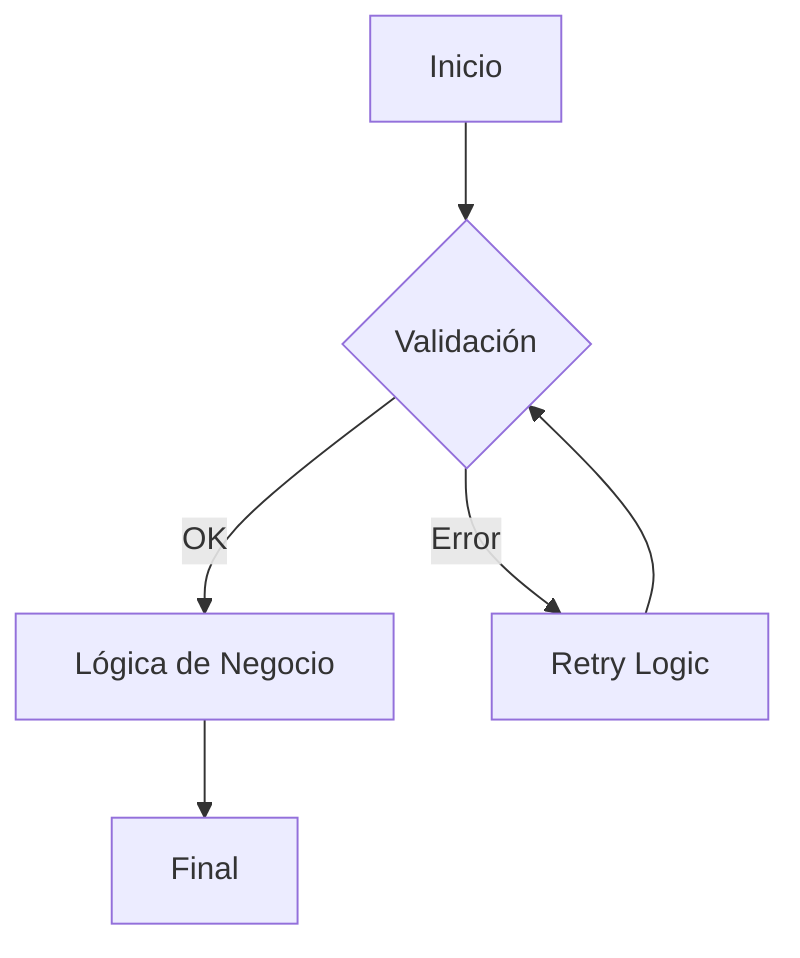

# Arquitectura del Sistema 🏗️

Este documento describe la visión arquitectónica de **LangGraph Real-World**, detallando cómo orquestamos agentes de IA resilientes.

---

## 🧩 Componentes Core

### 1. Grafo de LangGraph
El corazón del sistema es un grafo cíclico con estado que permite la iteración y corrección de errores por parte del agente.
- **Nodos**: Unidades lógicas de procesamiento (Ej: `score_candidate`, `schedule`).
- **Estados**: Datos persistentes que fluyen entre nodos.

### 2. Persistencia (Checkpoints)
Utilizamos **SQLite** para almacenar el estado del grafo en cada paso, permitiendo la recuperación ante reinicios y el guardado de "hilos" de conversación persistentes.

---

## 📊 Diagrama de Resiliencia

Para un análisis profundo, consulte el archivo [ARCHITECTURE.md](../ARCHITECTURE.md) en el repositorio.
