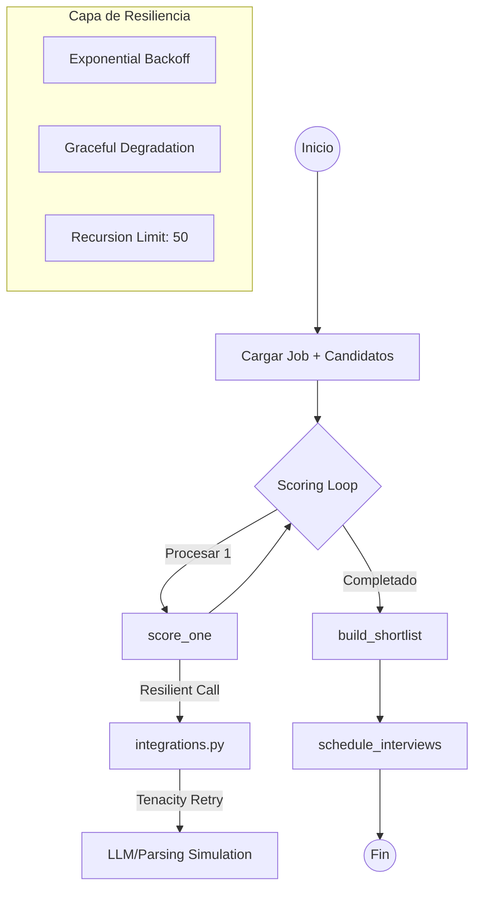

# 🤖 Caso 09: RR.HH. Screening + Agenda (Standardized)

**Detección de talento y agendamiento automatizado** con una arquitectura de agentes altamente resiliente. Este caso sirve como el **estándar de oro** del repositorio para implementaciones de producción.

## 🏗️ Arquitectura del Flujo



### 🔄 Ciclo de Vida del Agente (3 Fases)
Para este caso de uso, el agente opera en tres etapas claramente definidas:

1. **Fase 1: Lectura 📄**: Carga de perfiles y requisitos desde el sistema de archivos (Demos) o APIs de ATS (Producción).
2. **Fase 2: Análisis 🧠**: El LLM evalúa semánticamente cada CV y construye una shortlist basada en el encaje cultural y técnico.
3. **Fase 3: Acción (Agenda) 📅**: El agente toma la decisión final y coordina la agenda, reservando slots de entrevista.

---

---

## 🧠 Arquitectura Híbrida (Demo vs. Real IA)
Este caso está diseñado para funcionar en dos modalidades, detectando automáticamente si existe una llave de API en el archivo `.env`:

| Característica | 🧪 Modo Demo (Mock) | 🧠 Modo IA Real (OpenAI) |
| :--- | :--- | :--- |
| **Origen del Scoring** | Código determinista (Reglas fijas) | Análisis semántico del LLM |
| **Generación de Preguntas** | Lista estática (Fallback) | Preguntas personalizadas por candidato |
| **Motor de Razonamiento** | Algoritmos IF/ELSE | GPT-4o-mini (o superior) |
| **Latencia** | < 100ms | 1s - 3s (depende de la red/API) |

### ¿Qué hace el sistema exactamente?
1. **Screening (Nodo `score_one`)**: Evalúa el CV contra el Job Description. En modo IA, extrae matices cualitativos que el código fijo ignora.
2. **Personalización (Nodo `integrations.py`)**: Mientras el modo demo envía preguntas genéricas, el modo IA genera desafíos técnicos basados en los proyectos específicos que el candidato menciona en su CV.

---

## 🛡️ Resiliencia y Guardrails (Enterprise Grade)

| Característica | Implementación | Propósito |
| :--- | :--- | :--- |
| **Retries** | `tenacity` (backoff exponencial) | Manejo de errores intermitentes en APIs externas. |
| **Error Handling** | `try/except` en nodos del grafo | Evita el colapso del flujo; captura errores y continúa. |
| **Step Limits** | `recursion_limit: 50` | Previene bucles infinitos en el agente. |
| **Checkpoints** | `SqliteSaver` | Persistencia de estado e idempotencia. |
| **Health Checks** | `/health` & `/ready` | Monitoreo de liveness y readiness para CI/CD. |

---

## 🛠️ Tech Stack

- **Core**: [LangGraph](https://github.com/langchain-ai/langgraph) (Orquestación de agentes con estado).
- **Backend API**: [FastAPI](https://fastapi.tiangolo.com/) (Streaming NDJSON).
- **Resilience**: [Tenacity](https://tenacity.readthedocs.io/) (Estrategias de reintento).
- **Quality**: [Ruff](https://beta.ruff.rs/docs/) (Linting & Formatting).
- **Container**: [Docker](https://www.docker.com/) (Entorno reproducible).

---

## 🚀 Cómo empezar

### Ejecución Local

```bash
cd backend
python -m venv .venv
source .venv/bin/activate  # Windows: .\.venv\Scripts\Activate.ps1
pip install -r requirements.txt
uvicorn src.api:app --reload --port 8009
```
Abre: `http://localhost:8009`

### Validación con Docker (Smoke Tests)

Para validar la resiliencia y el flujo completo:
```bash
cd backend
docker compose -f compose.smoke.yml up --build --abort-on-container-exit
```

---

## 🧭 Activación "Real IA" (Paso a Paso)

Para habilitar el cerebro de agentes LangGraph (OpenAI) en lugar de la demo:

1. **Localiza la carpeta**: `cases/09-rrhh-screening-agenda/backend/`
2. **Crea el archivo `.env`**:
   ```env
   OPENAI_API_KEY=tu_key_aqui
   MODEL=gpt-4o-mini
   ```
3. **Inicia el servidor real**:
   ```bash
   uvicorn src.api:app --port 8009
   ```

**Ubicación física en el disco:**
```text
[PROYECTO_RAIZ]
└── cases/
    └── 09-rrhh-screening-agenda/
        └── backend/
            └── .env  <-- ESTE ES EL ARCHIVO QUE DEBES CREAR
```

---

## 📅 Activación de Fase 3 (Google Calendar)

Para que el agente pueda **Actuar** (Fase 3) y programar entrevistas reales:

1.  **Google Cloud Console**:
    - Crea un proyecto en [Google Cloud](https://console.cloud.google.com/).
    - Habilita la **Google Calendar API**.
    - Crea una **Service Account** y descarga la llave JSON.
2.  **Configuración del Caso 09**:
    - Comparte tu calendario de Google con el email de la Service Account (permisos de editor).
    - Copia el `Calendar ID` (ej: `tuemail@gmail.com` o el ID del calendario secundario).
3.  **Actualización del `.env`**:
    Añade estas líneas al archivo `.env` del backend:
    ```env
    GOOGLE_CALENDAR_ID=id_de_tu_calendario
    # Opcional: GOOGLE_APPLICATION_CREDENTIALS=ruta/a/tu/llave.json
    ```
4.  **Verificación**:
    Al presionar "Ejecutar" en la UI, el sistema detectará el `GOOGLE_CALENDAR_ID` y pasará de **"Modo Demo"** a **"Acción Real"**, creando eventos con links directos en la interfaz.

---

---
> [!IMPORTANT]
> Los logs están configurados en formato **JSON estructurado** para facilitar la integración con Datadog, ELK o CloudWatch.
